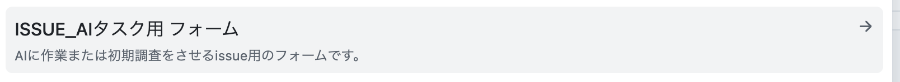

# AIタスクissueを使った作業依頼

<PORTAL_REPO> リポジトリでは、GitHub issueそのものをプロンプトとして、Claude Codeに調査・作業を行わせる運用ができる。

## 1. issueを作成する

- 「AIタスク」用issueフォーム（`.github/ISSUE_TEMPLATE/` 配下に用意する。例: `-form-issue_ai-task.yml`）でやらせたいことをまとめる
  - または、既存issueに `<AI_TASK_LABEL>` ラベルを付与する
  - フォームでは `labels: [<AI_TASK_LABEL>]` を指定し、ラベルが自動で付くようにしておく

  

- 自分自身をissueにアサインする

## 2. Claude Codeに処理させる

- 手元の<PORTAL_REPO>リポジトリでClaude Codeを起動する
- 「AIタスクissueを処理して」「AIタスクissueの作業をして」等と指示すると、`issue-worker` エージェントが呼び出される
- 自分にアサインされた `<AI_TASK_LABEL>` issueのうちどれを対象にするか聞かれるので選択する
- 調査・作業結果は該当issueにコメントとして投稿される（投稿前に `report-verifier` による検証と、ユーザーの確認を経る）

## 運用例

「AIで作業 → 内容を精査してnext actionを整理 → AIで作業 → …」という流れを繰り返し、issueコメントに証跡を残しながら進行させる使い方ができる。

## 関連

- [Claude Code設定の意図](./overview.md)
- [導入済みagent・skill一覧](./agents-and-skills.md)
