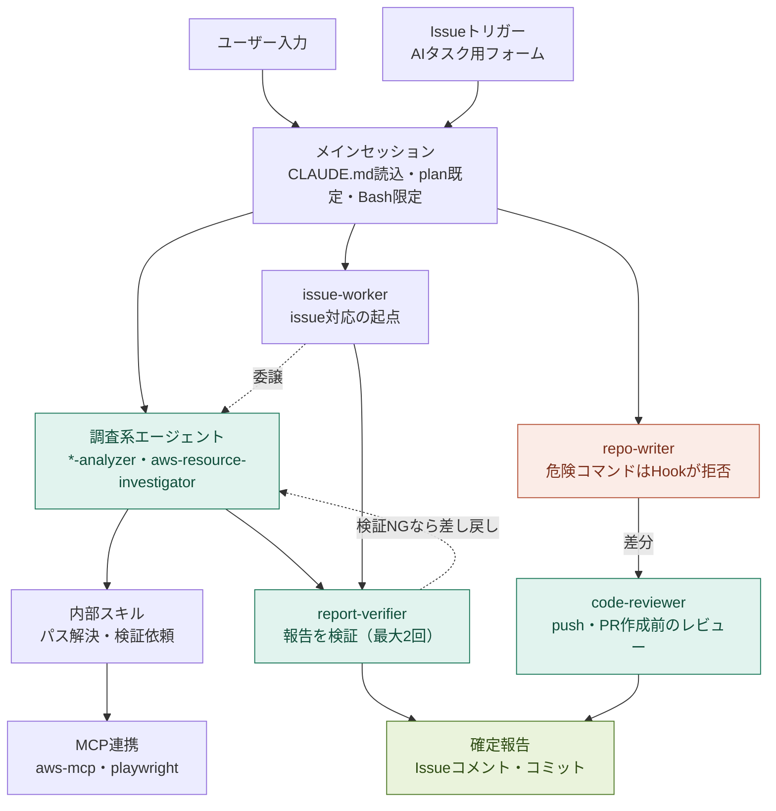

# Claude Code設定の意図

`<PORTAL_REPO>` リポジトリには Claude Code の設定一式（`.claude/`, `.mcp.json`）が導入されている。
これは「<PORTAL_REPO>リポジトリ用のAIアシスタント」というより、**チームの業務全般のための作業ポータル**として位置づけられている。日常的に扱う対象（各プロダクトのリポジトリ、AWS環境、GitHub Issue）を横断して、調査から実装まで一貫して進められることを目的としている。

凡例: 調査・検証・レビュー=緑系 ／ 書き込み=赤系 ／ 完了=黄緑 ／ その他=既定色

## 4つの柱

### 1. リポジトリ横断しての調査

主要リポジトリごとに、読み取り専用の調査専用エージェント（`*-analyzer`）を用意する。<PORTAL_REPO>リポジトリのセッションから各リポジトリの構成・実装を横断的に調査できる。雛形は `.claude/agents/example-analyzer.md`、一覧は [agents-and-skills.md](./agents-and-skills.md) を参照。

### 2. 実際のAWS環境との照らし合わせ

コードやTerraform定義上の設定だけでなく、`aws-resource-investigator` エージェントと `aws-mcp` を通じて、実際にAWS環境上でどう動いているか（インスタンス状態、設定値、セキュリティ設定等）を照らし合わせて確認できる。環境ごとの読み取り専用プロファイルで調査する。

### 3. 調査から実装へのシームレスな流れ

`*-analyzer` エージェントで対象リポジトリを調査した後、同じセッションから `repo-writer` エージェントに変更作業を依頼できる。`repo-writer` は対象リポジトリの `CLAUDE.md` や既存コーディング規約を守りながら、独立したgit worktree上で変更を行い、ユーザーの承認待ちの状態で止まる（commit/push/PR作成は行わない）。push・PR作成前には `code-reviewer` エージェントでレビューできる。調査だけで終わらず、そのまま実装まで一気通貫で進められる設計になっている。

### 4. issueベースでの作業指示・自動化

<PORTAL_REPO>リポジトリのGitHub Issue（「<AI_TASK_LABEL>」ラベル）を作成すると、コーディネーター型エージェント `issue-worker` が内容に応じて各analyzerエージェントへ調査を委譲し、結果をissueコメントとして投稿する。日常の定型的な調査依頼をissueベースで自動化できる。

すべての最終報告（issueコメント等）は、投稿前に検証専用エージェント `report-verifier` による敵対的検証を必ず経る運用になっており、事実誤認や推測の混入を防ぐ仕組みが組み込まれている。

具体的な使い方は [ai-task-issue-workflow.md](./ai-task-issue-workflow.md) を参照。

## 次に読むもの

- 使い始める前の準備: [getting-started.md](./getting-started.md)
- 導入済みのagent・skill一覧: [agents-and-skills.md](./agents-and-skills.md)
